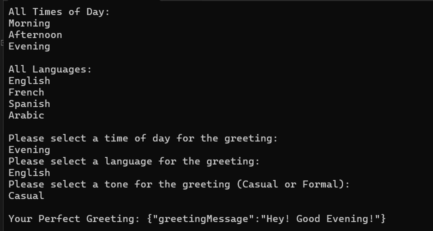

<strong> Name: Wesam Rabee </strong>

<strong> Student#:8820728 </strong>

It may take a second for the terminal to show you the cosnole for usig api (:

Dotnet run for the console
node server.js for the Node API to run (:
 
         |
URL LINK V
```bash
http://localhost:3000
```

The inputs are case sensitive, insure you type it as required.
- The following are the input options you have to choose from, you can copy and paste to minimise chance of error.

    Time Of Day
    - 
    -   Morning
    -   Afternoon
    -   Evening

    Languages
    -   
    -   English
    -   Spanish
    -   French
    -   Arabic  ( :

    Tone
    - 
    - Casual
    - Formal

    24 Possiblities
    -   
    There are 24, 6 for each language,3 Casual and 3 Formal, and a heads up, it is not a mistake, in arabic we use same phrase for afternoon and evening.

This is one of the possibilities after you replace the "string" with proper time and language.
- You can replace Morning in timeOfDay with
- Afternoon or Evening
- You can replace English in Language with
- Spanish, French, or Arabic
- You can replace Casual with Formal for tone

If you were to select the following inputs 
```bash
{
  "timeOfDay": "Evening",
  "language": "Arabic",
  "tone": "Casual"
}
```
You would recieve this for it

```BASH
{
  "greetingMessage": "Marhaba, Masa",
  "tone": "Casual"
}
```


<h1> Endpoint URL's</h1>

1. http://localhost:3000/api/WRgreet
2. http://localhost:3000/api/WRtimesOfDay
3. http://localhost:3000/api/WRlanguages

Of course, do not forget to start the API when testing, something I forgot for 10 minutes.

I will have the code for usign API from AS1 included and to run that you must type dotnet run in terminla, just in case you forgot for some reason (:

<h2> Below is what input and output may look like </h2>



In case the image does not work for YOU
```bash
Input 
All Times of Day:
Morning
Afternoon
Evening

All Languages:
English
French
Spanish
Arabic

Please select a time of day for the greeting:
Evening
Please select a language for the greeting:
English
Please select a tone for the greeting (Casual or Formal):
Casual
```
Output
```bash
Your Perfect Greeting: {"greetingMessage":"Hey! Good Evening!"}
```


